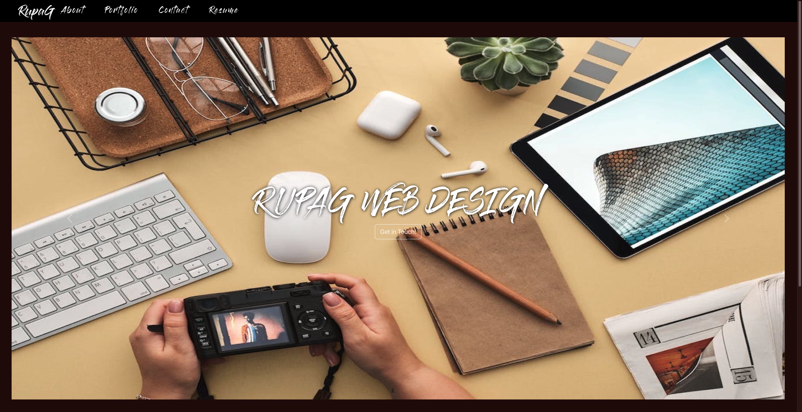
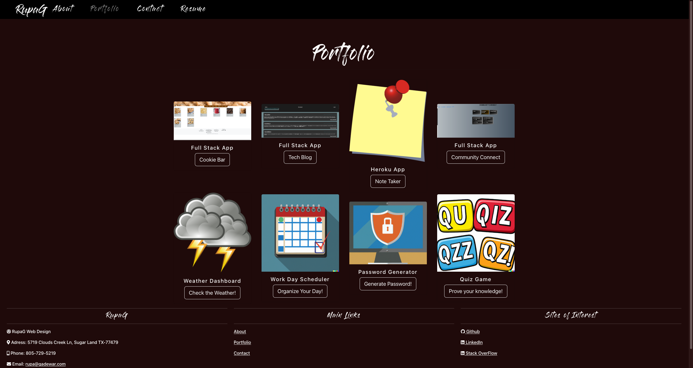
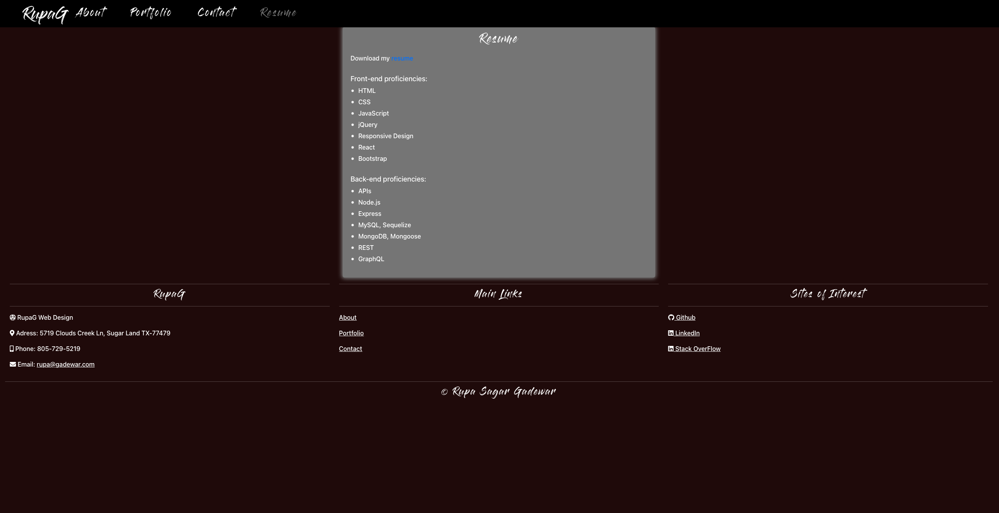
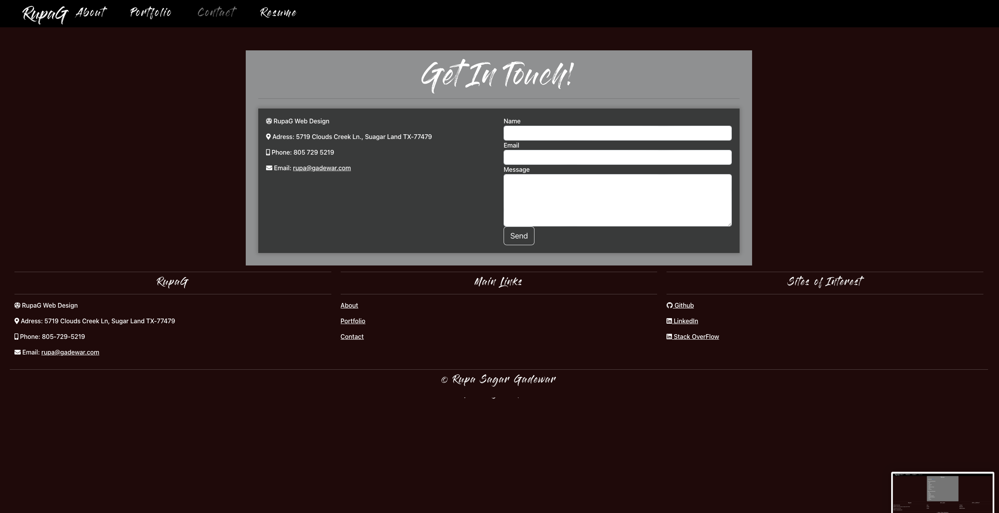

## Reactfolio

  
## Description 

Challenge is to create a portfolio, using your new React skills to help set you apart from other developers whose portfolios don’t use the latest technologies.

## User Story
AS AN employer looking for candidates with experience building single-page applications
I WANT to view a potential employee's deployed React portfolio of work samples
SO THAT I can assess whether they're a good candidate for an open position

## Table of contents

- [Description](#description)
- [Installation](#installation)
- [Usage](#usage)
- [license](#license)
- [Contributors](#contributors)
- [Tests](#tests)
- [Repository Link](#repository)
- [Questions](#questions)
- [Netlify](#netlify)

## Installation
To install necesary dependencies, run the following command:

        npm i

## Usage

        npm start

## license

## Contributors

https://github.com/rgadewar

## Tests
To run tests, run the following command:

          npm test

## Questions
If you have any questions about the repo, open an issue or contact me directly at email rupa@gadewar.com. You can find more of my work at
https://www.github.com/rgadewar

## Repository

- [Project Repo](https://github.com/rgadewar/Reactfolio)

## Netlify
- [Deployed Link](https://reactfolio1.netlify.app)